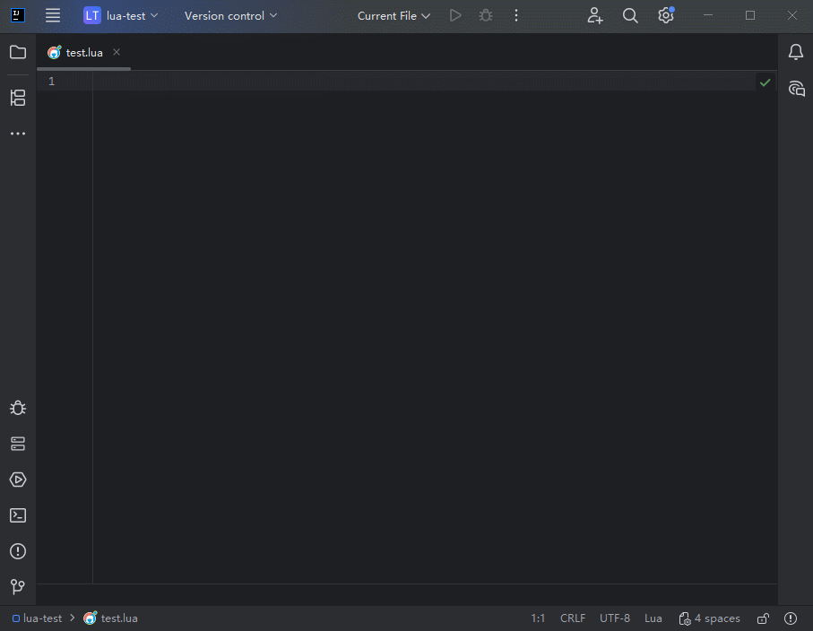

## Emmy Attach Debugger

> **Windows only.** Requires `emmy_tool.exe` and `emmy_hook.dll` (bundled with the plugin).

Attaches the Emmy Lua debugger to a **running process** by injecting `emmy_hook.dll` at runtime. No recompilation or pre-instrumentation needed.

### Setup

1. Open **Run → Edit Configurations** and add an **Emmy Attach Debugger** configuration.
2. Choose an attach mode:
   - **Pid** — enter the target process ID directly.
   - **Process Name** — enter a name/path substring. If multiple processes match, a picker dialog appears; if nothing matches, all running processes are shown.
3. Set **Encoding** to match the target process's string encoding (e.g. `gbk` for most Windows CJK apps, `utf-8` otherwise).
4. Set **Architecture** to `Auto detect`, or override with `x86`/`x64` if auto-detection fails or the process is elevated.

### Usage

Start the configuration with the **Debug** action. The plugin will:

1. Detect (or use the specified) process architecture.
2. Inject `emmy_hook.dll` into the target process via `emmy_tool.exe`.
3. Connect to the debugger hook over TCP on `127.0.0.1`.

Set breakpoints in your Lua source files before or after attaching — they take effect immediately.

### Notes

- If the target process is **elevated** (run as administrator), the IDE must also be run as administrator.
- The injected `emmy_hook.dll` is released when the debug session ends.
